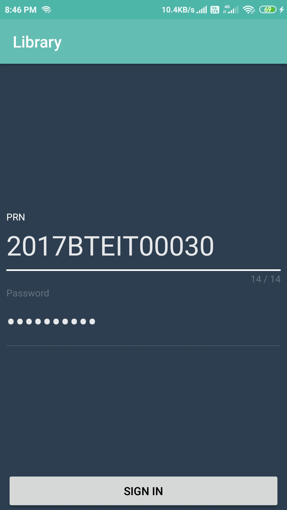
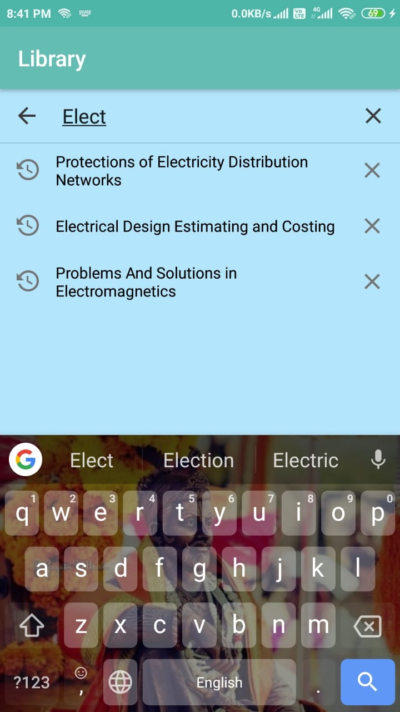
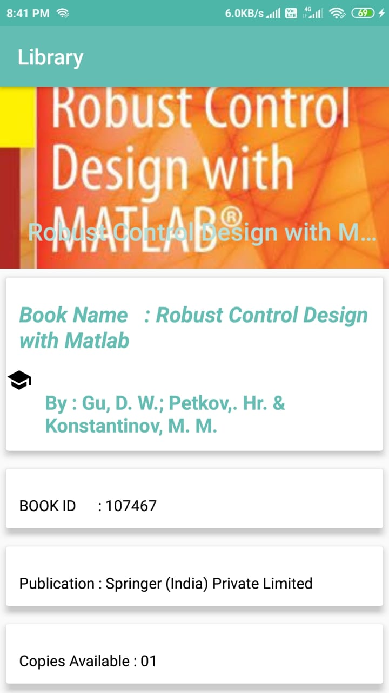
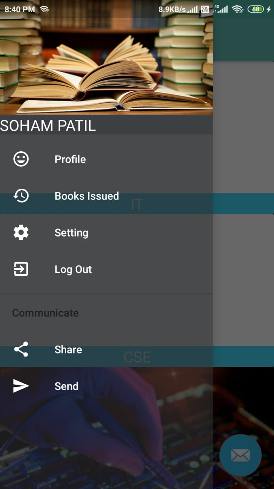

# Smart-Libarary

<ul>
	<li>Developed two android applications enabling the students and the librarian to track books</li>
	<li>Reduced paperwork and time involved </li>
</ul>
<h2>Project consists of following Modules</h2>

<ol>
	<li> Student Module</li>
	<li>Admin Module (Librarian)</li>
</ol>

# screenshots of Student Module

<table width="100%" border="0">
  
  <tr>    
    <td></td>
    <td></td>
    <td></td>
  </tr>

  <tr>    
      <td></td>
      <td></td>
      <td></td>
  </tr>
</table>
